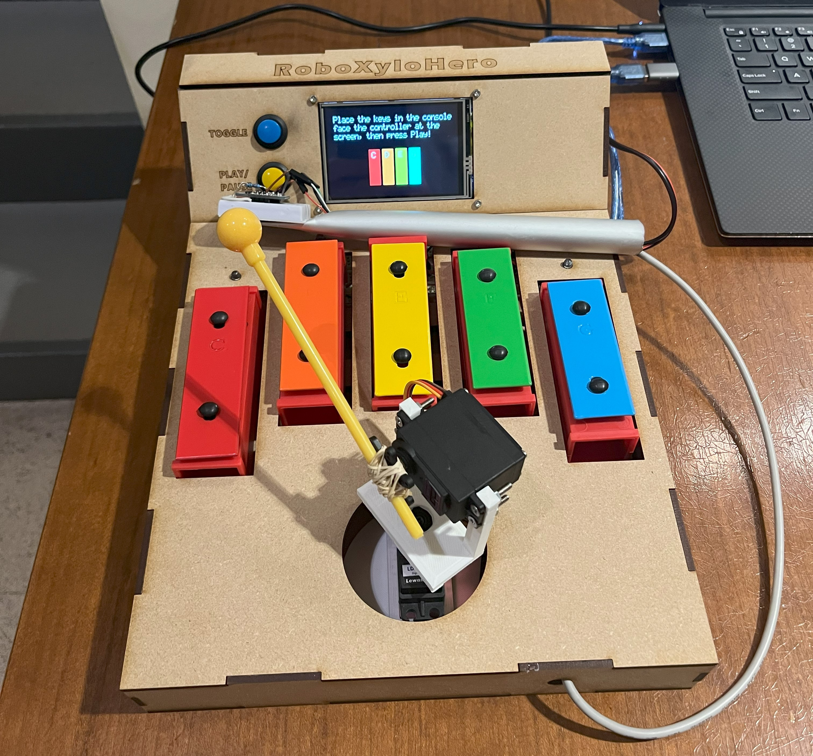

## RoboXyloHero
RoboXyloHero is a robotic musical arcade game. I built it with a team of 3 as the final project for our Embedded Systems class. The game is inspired by the musical video games of our youth, but with a robotic twist. The entire project is written in C for the Atmega328p (Arduino UNO) using minimal existing libraries. 

## What it does
The project comprises two main components: a game console and a robotic arm xylophone player. The console has spaces for 5 xylophone notes which can be changed around depending on what song the user wants to play. The user select between 5 songs, and the built-in LCD screen instructs the user on which notes to place in the console. During the game, the LCD displays falling bars representing music notes for the user to play when they reach the bottom. The user plays the game by waving the motion-based controller as if they were actually playing the xylophone. The 2-degree of freedom robot arm tracks the side to side motion of the controller's IMU, allowing the user to hover over different notes. Then, by emulating a striking motion, the user makes the robot strike the key.

## How we built it
The system is built using two isolated Arduino Uno microcontrollers. The MCU communicates to the LCD screen using an SPI interface and a custom graphics library. Notes are released on a cadence using interrupts to ensure a consistent tempo.

The MCU communicates with the IMU via I2C using a self-written library. The 9-DOF IMU provides acceleration as well as absolute orientation in 3D using an accelerometer. For our application, we use the "yaw" orientation to track between notes and the z-axis acceleration to detect a striking motion. The robot consists of 2 servo motors controlled using PWM signals.

The housings for the robot motors were 3D printed, and the console housing was laser cut.